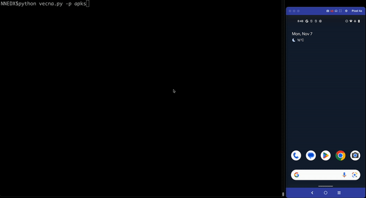

# Vecna

Automatic tool to find arbitrary Intent that gets reflected back vulnerabilities on Android apps.



## Requirements

 * Rooted device with frida-server running.
 * radare2 installed. https://github.com/radareorg/radare2
 * Frida installed. https://github.com/frida/frida
 
## Installation

```
pip install -r requirements.txt
```

## Usage

* Help message:

```
usage: vecna.py [-h] [-p PATH]

vecna by Murphy

optional arguments:
  -h, --help            show this help message and exit
  -p PATH, --path PATH  Defines the path of the APKs to analyze
```

* To analyze all the APKs from an specific path:

```
python vecna.py -p [PATH]
```
